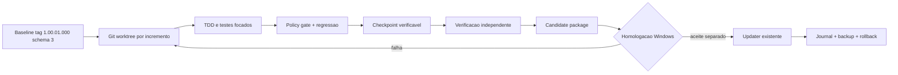

# Arquitetura do ambiente de edição e update

## Decisão e escopo

A fonte do handoff é preservada em Git. Mudanças são produzidas em worktrees independentes, verificadas por changeset e empacotadas apenas após gates de regressão. O SQLCipher local continua sendo a persistência do produto desktop; Supabase é reservado para registro/laboratório de engenharia isolado e não substitui o banco operacional nesta etapa.

## Componentes

| ID | Responsabilidade | Estado/autoridade |
|---|---|---|
| C-01 | Git baseline/worktrees | fonte e isolamento |
| C-02 | Changeset JSON | escopo permitido e schema step |
| C-03 | Guard Python | preflight, diff policy, checkpoints e candidate gate |
| C-04 | PowerShell wrappers | execução Windows repetível |
| C-05 | Test matrix | evidência mínima por fase |
| C-06 | Supabase `ustracker_eng` | registro opcional de engenharia em ambiente dedicado |
| C-07 | Updater original | aplicação/rollback no produto, somente após autorização |

## Falhas

- Mudança fora do escopo: candidate gate falha.
- Salto/regressão de schema: changeset inválido.
- Baseline tag alterada: preflight falha.
- Teste/build falha: changeset não recebe `VERIFIED`.
- Homologação falha: candidate não é promovida.
- Update falha antes de `ACCEPTED`: usar o journal/backup do updater existente.
